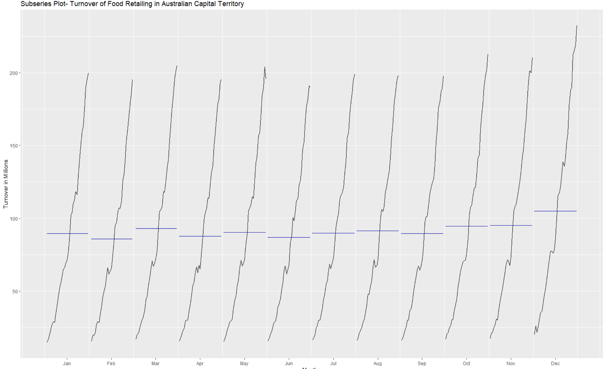
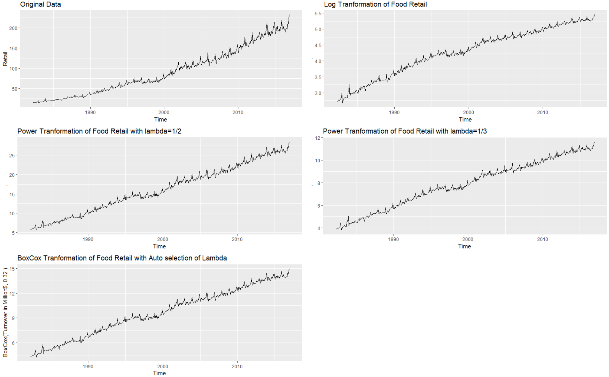
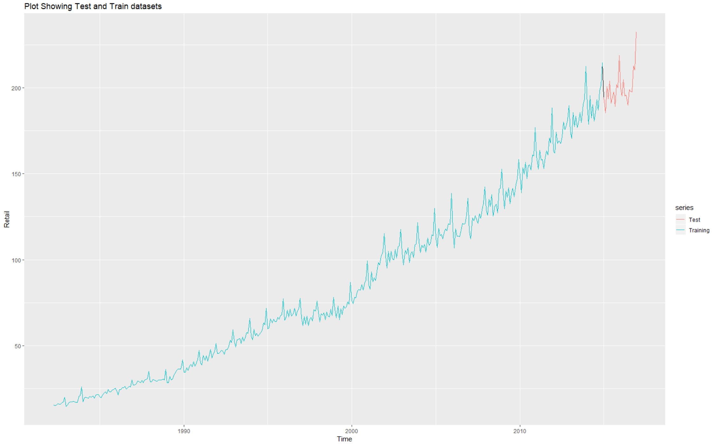
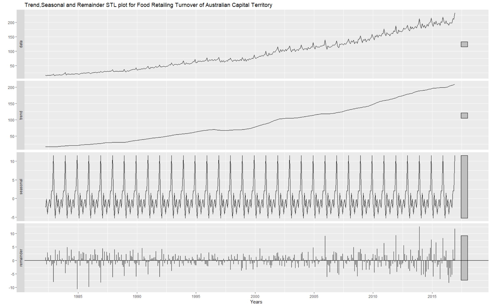
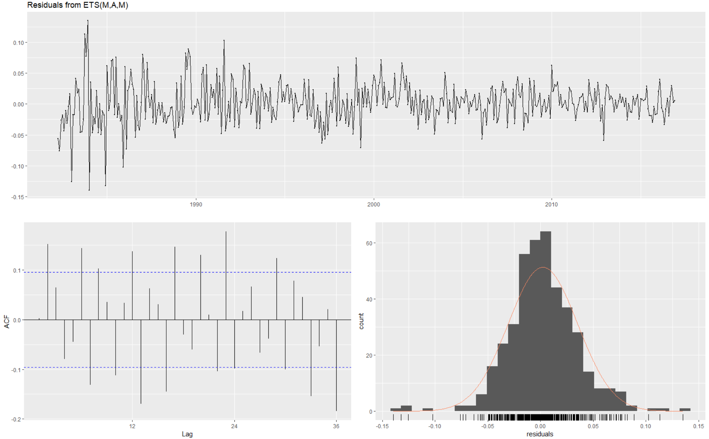

## Time Series Analysis using Auto Regressor and logistic , Box Cox Transformation.

Food Retail data of Australia Capital Territory has been analysed:

1. **Sub series plot to check the variation in each month over a particular year.**

 

2. **The different type of transformation has been applied to the data to make it stationary :**

 * Log Transformation
 * Power Transformation with different lambda
 * BoxCox transformation with automatic selection

 
 

3. **Dividing the test and train to check the prediction.**

 
 

4. **Trend , Seasonal and Remainder STL plot for the food data.**

 
 

5. **Seasonal trend has been analysed.**

6. **Residuals has been calculated and the trend has been carefully analysed.**

7. **Auto regressor model has been used for the prediction using BoxCox transformation which was the best transformation.**